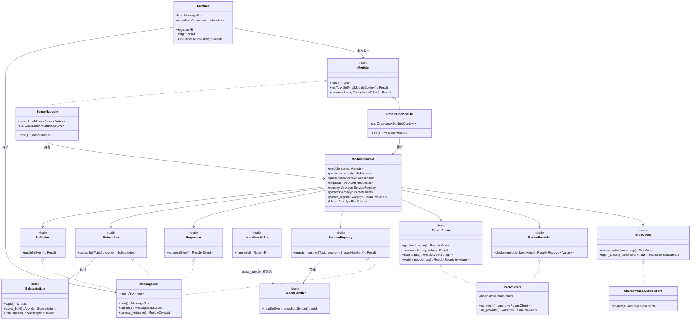

# 架构设计文档

> 本文档详细描述消息总线中间件的架构设计、类关系、调用链路与接口定义。
>
> 对应版本：v0.0.1

---

## 目录

- [依赖方向](#依赖方向)
- [UML 类图](#uml-类图trait-与实现关系)
- [模块生命周期](#模块生命周期)
- [四种通信语义的调用链路](#四种通信语义的调用链路)
  - [1. 发布/订阅（Pub/Sub）](#1-发布订阅pubsub)
  - [2. 请求/响应（Request/Response）](#2-请求响应requestresponse)
  - [3. 参数 get/set + watch 热更新](#3-参数-getset--watch-热更新)
  - [4a. 大文件背压流传输](#4a-大文件背压流传输)
  - [4b. SharedBlob 句柄经事件通道传递](#4b-sharedblob-句柄经事件通道传递)
- [接口汇总](#接口汇总)

---

## 依赖方向

```
┌─────────────────┐     ┌──────────────────┐
│ module-sensor   │     │ module-processor │   ← 业务模块（互不依赖）
│                 │     │                  │
│ 只依赖 bus-api  │     │ 只依赖 bus-api   │
└────────┬────────┘     └────────┬─────────┘
         │                       │
         ▼                       ▼
     ┌───────────────────────────────┐
     │          bus-api              │   ← 纯抽象层（trait + 消息类型 + 错误定义）
     │  Publisher / Subscriber       │
     │  Requester / Handler          │
     │  ParamClient / ParamProvider  │
     │  BlobClient / Module          │
     └──────────────┬────────────────┘
                    │  implements
                    ▼
     ┌───────────────────────────────┐
     │        bus-runtime            │   ← tokio 实现层
     │  MessageBus (核心总线)         │
     │  Runtime (装配运行器)          │
     │  ParamStore / BlobClient      │
     └──────────────┬────────────────┘
                    │  组装
                    ▼
     ┌───────────────────────────────┐
     │       src/main.rs             │   ← 装配层（Composition Root）
     │  创建总线 → 注册模块 → 初始化  │
     │  → 并发运行 → 优雅停机         │
     └───────────────────────────────┘
```

**核心约束**：依赖箭头只能向下，不能向上或横向。

- `bus-api` 不依赖任何业务 crate，也不依赖 `bus-runtime`
- `bus-runtime` 依赖 `bus-api`，为其 trait 提供实现
- 业务模块（`module-sensor`、`module-processor`）只依赖 `bus-api`，互不依赖
- 只有 `main.rs`（装配层）认识所有模块，把它们注册到同一个运行时

---

## UML 类图（Trait 与实现关系）



### 关键关系说明

| 关系 | 说明 |
|---|---|
| `Module <|.. SensorModule` | 业务模块实现 `Module` trait |
| `Publisher <|.. MessageBus` | `MessageBus` 同时实现 4 个能力 trait（Publisher/Subscriber/Requester/ServiceRegistry） |
| `Handler~M,R~ ..> ErasedHandler` | `erase_handler` 函数把强类型 handler 适配为类型擦除版本 |
| `ModuleContext --> *` | 模块通过 context 持有各种能力句柄（全是 `Arc<dyn Trait>`） |
| `Runtime --> Module` | 运行时持有所有已注册模块，统一 init/run/shutdown |

---

## 模块生命周期

```
main.rs
  │
  ├── MessageBus::builder().build()        ← 创建总线
  │   └── MessageBusBuilder
  │       ├── broadcast_capacity(256)
  │       ├── request_timeout(5s)
  │       └── build() → MessageBus { Arc<Inner> }
  │
  ├── Runtime::new(bus)
  ├── runtime.register(SensorModule::new())
  │   └── modules.push(Arc::new(module))
  ├── runtime.register(ProcessorModule::new())
  │
  ├── runtime.init().await                 ← 初始化阶段（必须在 run 之前）
  │   │
  │   │  对每个模块：
  │   ├── bus.context_for(module.name())
  │   │   └── 构造 ModuleContext
  │   │       ├── module_name: Arc<str>
  │   │       ├── publisher/subscriber/requester/registry: Arc<MessageBus>
  │   │       ├── params/param_registry: Arc<ParamStore>
  │   │       └── blobs: Arc<SharedMemoryBlobClient>
  │   │
  │   └── module.init(&ctx).await
  │       │
  │       ├── SensorModule::init
  │       │   ├── ctx.set(ctx.clone())              ← 保存 context 供 run 使用
  │       │   ├── param_registry.declare("sample_interval_ms", 500)
  │       │   ├── param_registry.declare("unit", "celsius")
  │       │   ├── registry.register_handler("sensor.read_now", ReadNowHandler)
  │       │   │   └── erase_handler(ReadNowHandler) → Arc<dyn ErasedHandler>
  │       │   └── registry.register_handler("sensor.stats", StatsHandler)
  │       │
  │       └── ProcessorModule::init
  │           └── ctx.set(ctx.clone())              ← 仅保存 context
  │
  ├── CancellationToken::new()             ← 停机控制
  │   └── tokio::spawn(select! {
  │       ctrl_c() => token.cancel(),
  │       sleep(10s) => token.cancel()
  │   })
  │
  └── runtime.run(shutdown).await          ← 运行阶段
      │
      │  对每个模块：
      ├── tokio::spawn(async move {
      │       module.run(token.clone()).await
      │   })
      │
      │  SensorModule::run 内部：
      │  └── loop {
      │          select! {
      │              shutdown.cancelled() => break,
      │              ticker.tick() => {
      │                  let ev = state.lock().sample();
      │                  temperature.publish(ctx.publisher, source, ev);
      │              },
      │              interval_rx.changed() => {
      │                  let new_ms = value_to_u64(&interval_rx.borrow());
      │                  ticker = interval(Duration::from_millis(new_ms));
      │              }
      │          }
      │      }
      │
      │  ProcessorModule::run 内部：
      │  ├── spawn(consume_temperature)    ← 订阅温度 + 累计5条后请求统计
      │  ├── param_demo()                  ← 参数 get/set/list/错误处理
      │  ├── blob_stream_demo()            ← 8MiB 背压流传输
      │  ├── blob_handle_demo()            ← SharedBlob 句柄零拷贝传递
      │  └── shutdown.cancelled().await
      │
      ├── shutdown.cancelled().await       ← 主任务等待停机信号
      └── for handle in handles { handle.await }  ← 等待各模块优雅退出
```

---

## 四种通信语义的调用链路

### 1. 发布/订阅（Pub/Sub）

**场景**：SensorModule 周期发布温度事件 → ProcessorModule 订阅消费

```
SensorModule::run                    MessageBus (Publisher)        MessageBus (Subscriber)
    │                                     │                             │
    │ ticker.tick() 触发                   │                             │
    │                                     │                             │
    │── temperature.publish(              │                             │
    │     ctx.publisher, source, ev) ───→│                             │
    │                                     │ publish(event)              │
    │                                     │   ├─ topic_sender("sensor.temperature")
    │                                     │   │   └─ RwLock<HashMap> 查表或惰性创建
    │                                     │   │      broadcast::channel(256)
    │                                     │   └─ tx.send(event)         │
    │                                     │      └─ 无订阅者 → NoSubscriber
    │                                     │         有订阅者 → 广播到所有 rx
    │                                     │                             │
    │                                     │                    ProcessorModule::run
    │                                     │                         │
    │                                     │   subscribe("sensor.temperature")
    │                                     │     ├─ topic_sender() 取 broadcast::Sender
    │                                     │     └─ 返回 BroadcastSubscription { topic, tx }
    │                                     │                             │
    │                                     │   into_stream()              │
    │                                     │     ├─ tx.subscribe() → broadcast::Receiver
    │                                     │     └─ BroadcastStream::new(rx)
    │                                     │        .filter_map(Lagged → warn + None)
    │                                     │        → Pin<Box<dyn Stream<Item=Event>>>
    │                                     │                             │
    │                                     │   stream.next().await        │
    │                                     │     └─ 收到 Event            │
    │                                     │                             │
    │                                     │   temperature.take(&event)   │
    │                                     │     └─ payload.downcast_ref::<TemperatureEvent>()
    │                                     │        └─ Ok(&TemperatureEvent) → clone
```

**底层原语**：`tokio::sync::broadcast`（每 topic 一个，环形缓冲 256）

**关键设计**：
- `publish` 是同步的——`broadcast::send` 本身非阻塞
- 慢消费者丢帧时 `Lagged` 错误被 `filter_map` 消化为 warn 日志，流不中断
- 每个 `clone_box()` 得到独立的 receiver，互不抢占消息

---

### 2. 请求/响应（Request/Response）

**场景**：ProcessorModule 请求 SensorModule 的统计服务

```
ProcessorModule                      MessageBus (Requester)         Adapter (ErasedHandler)
    │                                     │                             │
    │ stats_svc.request(                  │                             │
    │   ctx.requester, source,            │                             │
    │   StatsRequest) ──────────────────→│                             │
    │                                     │ request(event)              │
    │                                     │   ├─ handlers.lock()
    │                                     │   │   .get("sensor.stats")
    │                                     │   │   → Arc<dyn ErasedHandler>
    │                                     │   │
    │                                     │   ├─ oneshot::channel()
    │                                     │   │   → (reply_tx, reply_rx)
    │                                     │   │
    │                                     │   ├─ handler.handle(event, reply_tx)
    │                                     │   │   │                         │
    │                                     │   │   │  ┌──────────────────────┘
    │                                     │   │   │  │
    │                                     │   │   │  ▼
    │                                     │   │   │  Adapter::handle(req, reply_tx)
    │                                     │   │   │    ├─ req.payload.downcast::<StatsRequest>()
    │                                     │   │   │    │   → Ok(arc_msg) → clone → msg: StatsRequest
    │                                     │   │   │    │   → Err(_) → reply.send(TypeMismatch) + return
    │                                     │   │   │    │
    │                                     │   │   │    ├─ tokio::spawn(async move {
    │                                     │   │   │    │     inner.handle(msg).await
    │                                     │   │   │    │       → StatsHandler::handle(StatsRequest)
    │                                     │   │   │    │       → Result<SensorStats>
    │                                     │   │   │    │
    │                                     │   │   │    │     Event::payload_arc(stats) → Arc<dyn Any>
    │                                     │   │   │    │     Event::new(topic, source, payload) → resp_event
    │                                     │   │   │    │     reply_tx.send(Ok(resp_event))
    │                                     │   │   │    │   })
    │                                     │   │   │    │
    │                                     │   │   │    └─ return（立即返回，不阻塞总线分发）
    │                                     │   │
    │                                     │   └─ timeout(5s, reply_rx).await
    │                                     │       ├─ Ok(Ok(event)) → event（正常响应）
    │                                     │       ├─ Ok(Err(_))    → Closed（handler drop 了 reply_tx）
    │                                     │       └─ Err(elapsed)  → Timeout（5s 超时）
    │                                     │                             │
    │←── resp_event.payload_cloned::<SensorStats>() ←──────────────────│
    │     └─ downcast_ref::<SensorStats>() → clone → SensorStats
```

**底层原语**：`tokio::sync::oneshot` + `tokio::spawn` + `tokio::time::timeout`

**关键设计**：
- `ErasedHandler::handle` 是**同步**方法——内部 `spawn` 后立即返回，总线分发循环不被阻塞
- `oneshot` 用于一问一答：请求方持有 `rx` await，handler 完成后 `tx.send(resp)`
- downcast 在 `spawn` 之前完成：类型错误可同步反馈给请求方（`TypeMismatch`）
- handler 在独立 task 中执行：即使 handler 耗时很长，也不影响其他请求

---

### 3. 参数 get/set + watch 热更新

**场景**：ProcessorModule 修改 SensorModule 的采样周期参数，SensorModule 即时感知

```
ProcessorModule                      ParamStore (ParamClient)        SensorModule
    │                                     │                             │
    │── params.get("sensor",              │                             │
    │     "sample_interval_ms") ────────→│                             │
    │                                     │ get(module, key)            │
    │                                     │   ├─ modules.read()         │
    │                                     │   │   .get("sensor")        │
    │                                     │   │   .get("sample_interval_ms")
    │                                     │   │   → ParamEntry { tx: watch::Sender }
    │                                     │   └─ tx.borrow().clone()
    │                                     │       → Value::U64(500)
    │←── Ok(Value::U64(500)) ────────────│                             │
    │                                     │                             │
    │── params.set("sensor",              │                             │
    │     "sample_interval_ms",           │                             │
    │     Value::U64(200)) ─────────────→│                             │
    │                                     │ set(module, key, value)     │
    │                                     │   └─ tx.send_modify(|slot|  │
    │                                     │        *slot = Value::U64(200))
    │                                     │       │                     │
    │                                     │       │  watch 通知所有 rx   │
    │                                     │       └───────────────────→│
    │                                     │                             │ interval_rx.changed()
    │                                     │                             │   ├─ borrow_and_update()
    │                                     │                             │   │   → Value::U64(200)
    │                                     │                             │   └─ ticker = interval(200ms)
    │                                     │                             │
    │←── Ok(()) ─────────────────────────│                             │
```

**底层原语**：`std::sync::RwLock<HashMap>` + `tokio::sync::watch`

**关键设计**：
- `watch` 是覆盖式语义：只保留最新值，旧值自动丢弃（适合配置参数）
- `send_modify` 一定成功（不因无接收者而失败），并即时唤醒所有 `changed()` 等待者
- `borrow_and_update()` 标记"已读当前值"，避免首次 `changed()` 立即返回造成伪触发
- 参数表用 `std::sync::RwLock`（不是 tokio 的）：临界区极短（查表 + clone），无需异步锁

---

### 4a. 大文件背压流传输

**场景**：8MiB 数据经 64KiB 分块、仅缓冲 2 块的 mpsc 流发送

```
ProcessorModule (发送端)               SharedMemoryBlobClient        ProcessorModule (接收端)
    │                                     │                             │
    │── open_blob_stream("bigfile.bin",   │                             │
    │     64KiB, 2) ────────────────────→│                             │
    │                                     │ open_stream(name, chunk, buf)
    │                                     │   └─ mpsc::channel(2)       │
    │                                     │      → (BlobSink { tx }, BlobStream { rx })
    │←── (sink, stream) ─────────────────│                             │
    │                                     │                             │
    │ tokio::spawn(send_all(sink, data))  │                             │
    │   │                                 │                             │
    │   ├─ data.copy_to_bytes(64KiB)      │                             │
    │   ├─ sink.send(chunk).await         │                             │
    │   │   └─ mpsc::tx.send(chunk)       │                             │
    │   │      ├─ 缓冲未满 → 立即返回     │                             │
    │   │      └─ 缓冲已满 → await 挂起   │  ← 背压点！                │
    │   │         （等接收端取走一块）     │                             │
    │   ├─ ... 循环发送 128 块 (8MiB/64KiB)│                             │
    │   └─ sink.finish() → drop(tx)      │                             │
    │      └─ 通道关闭，rx.recv() 返回 None│                             │
    │                                     │                             │
    │                                     │               stream.collect_to_end().await
    │                                     │                 └─ loop {
    │                                     │                      rx.recv().await
    │                                     │                        → Some(chunk) → buf.extend_from_slice
    │                                     │                        → None → break（发送端关闭）
    │                                     │                    }
    │                                     │                 └─ buf.freeze() → Bytes（完整 8MiB）
    │                                     │                             │
    │                                     │               checksum(&received) == expected?
    │                                     │               → true（数据完整）
```

**底层原语**：`tokio::sync::mpsc`（有界通道）

**关键设计**：
- 背压 = 有界通道 + `send().await`：缓冲满时发送方被挂起，压力反向传导
- 内存上限 = `chunk_size × buf_chunks` = 64KiB × 2 = 128KiB（远小于 8MiB 数据）
- `collect_to_end` 保证"接收方拿到完整数据后才能计算"的语义
- `sink.finish()` 通过 `drop(tx)` 关闭通道，接收端 `recv()` 返回 `None` 表示结束

---

### 4b. SharedBlob 句柄经事件通道传递

**场景**：写入共享内存 blob → 经 pub/sub 传句柄 → 接收端零拷贝读取

```
ProcessorModule                      MessageBus (Pub/Sub)           ProcessorModule
    │                                     │                             │
    │ writer = ctx.blob_writer("shared.bin", 1024)
    │   └─ BlobWriter { name, buf: BytesMut }
    │ writer.write_chunk(data_512)
    │ writer.write_chunk(data_512)
    │ blob = writer.finish()
    │   └─ SharedBlob { name: Arc<str>, data: Bytes }
    │      （BytesMut.freeze() → 不可变 Bytes）
    │                                     │                             │
    │── blob_ready.publish(               │                             │
    │     ctx.publisher, source,          │                             │
    │     blob.clone()) ────────────────→│                             │
    │   （blob.clone() 仅 Bytes 引用计数+1，零拷贝）
    │                                     │ broadcast::send(event)      │
    │                                     │   event.payload =           │
    │                                     │     Arc<dyn Any> → SharedBlob
    │                                     │────────────────────────────→│
    │                                     │                             │
    │                                     │               blob_ready.take(&event)
    │                                     │                 └─ payload.downcast_ref::<SharedBlob>()
    │                                     │                    → &SharedBlob → clone
    │                                     │                             │
    │                                     │               received.read()
    │                                     │                 └─ Bytes.clone()（零拷贝，仅引用计数+1）
    │                                     │               checksum(&received.read())
    │                                     │                 → true（数据完整）
```

**底层原语**：`Arc<Bytes>`（写一次读多次的共享缓冲）

**关键设计**：
- 事件通道只传**句柄**（`SharedBlob`），不传数据本身
- `SharedBlob::clone()` 和 `Bytes::clone()` 都是引用计数操作，零拷贝
- 适合放得进内存的文件；超大文件用 4a 的背压流

---

## 接口汇总

### bus-api：核心 trait

| Trait | 方法 | 说明 |
|---|---|---|
| `Publisher` | `publish(Event) -> Result` | 向 topic 广播事件（同步） |
| `Subscriber` | `subscribe(Topic) -> Arc<dyn Subscription>` | 建立订阅会话 |
| `Subscription` | `topic() / clone_box() / into_stream()` | 订阅句柄，可转为 Stream |
| `Requester` | `request(Event) -> Result<Event>` | 发起请求/响应（异步） |
| `ServiceRegistry` | `register_handler(Topic, Arc<dyn ErasedHandler>)` | 注册服务 handler |
| `ErasedHandler` | `handle(Event, oneshot::Sender)` | 类型擦除的 handler（内部 spawn） |
| `Handler<M, R>` | `handle(M) -> Result<R>` | 强类型 handler（业务实现） |
| `ParamClient` | `get / set / list / watch` | 参数读写 + 热更新订阅 |
| `ParamProvider` | `declare(module, key, initial)` | 模块声明自己的参数 |
| `BlobClient` | `create_writer / open_stream` | 大文件传输工厂 |
| `Module` | `name / init / run` | 模块生命周期 |

### bus-api：数据类型

| 类型 | 说明 |
|---|---|
| `Event` | 事件信封：topic + source + `Arc<dyn Any>` 载荷 |
| `Topic` | 路由键（newtype over String） |
| `Value` | 参数值枚举：Bool / I64 / U64 / F64 / String / Bytes / Json |
| `Payload` | `Arc<dyn Any + Send + Sync>`（事件载荷别名） |
| `Typed<M>` | 类型化 topic（pub/sub 用），Phantom Type 提供编译期类型安全 |
| `TypedService<Req, Resp>` | 类型化服务端点（请求/响应用） |
| `SharedBlob` | 写一次读多次的共享缓冲（`Arc<Bytes>`） |
| `BlobWriter` | SharedBlob 的写入端（`BytesMut` 累积 → `freeze()`） |
| `BlobSink` | 背压流发送端（`mpsc::Sender`） |
| `BlobStream` | 背压流接收端（`collect_to_end` 聚合完整数据） |
| `BusError` | 统一错误：NoHandler / Timeout / TypeMismatch / ParamNotFound / Closed / NoSubscriber / SlowConsumer 等 |
| `ModuleContext` | 模块能力上下文：持有所有 `Arc<dyn Trait>` 句柄 |

### bus-runtime：实现层

| 类型 | 实现的 trait | 说明 |
|---|---|---|
| `MessageBus` | Publisher + Subscriber + Requester + ServiceRegistry | 核心总线（路由表 + 广播 + 请求响应） |
| `ParamStore` | ParamClient + ParamProvider | 参数存储（RwLock + watch） |
| `SharedMemoryBlobClient` | BlobClient | 进程内共享内存 Blob 实现 |
| `BroadcastSubscription` | Subscription | 基于 broadcast receiver 的订阅会话 |
| `Runtime` | — | 装配运行器（register → init → run → shutdown） |
| `MessageBusBuilder` | — | 总线构造器（配置 broadcast_capacity / request_timeout / blob_client / param_store） |

### 类型擦除流程

```
业务代码（强类型）                    erase_handler                    总线（类型擦除）
─────────────────                    ──────────────                    ────────────────
impl Handler<ReadNow, TemperatureEvent>                               
  for ReadNowHandler {                                                
    async fn handle(msg: ReadNow)                                     
      -> Result<TemperatureEvent>                                     
  }                                                                   
       │                                                              
       │  erase_handler::<ReadNow, TemperatureEvent, ReadNowHandler>  
       ▼                                                              
  Adapter<ReadNow, TemperatureEvent, ReadNowHandler>                  
    impl ErasedHandler {                                              
      fn handle(req: Event, reply: oneshot::Sender) {                 
        // 入站 downcast：Event.payload → ReadNow                     
        // spawn 中调用 inner.handle(msg)                             
        // 出站 upcast：TemperatureEvent → Event.payload               
      }                                                               
    }                                                                 
       │                                                              
       ▼                                                              
  Arc<dyn ErasedHandler>  ──────────────────────────────────────────→ 路由表存储
```
